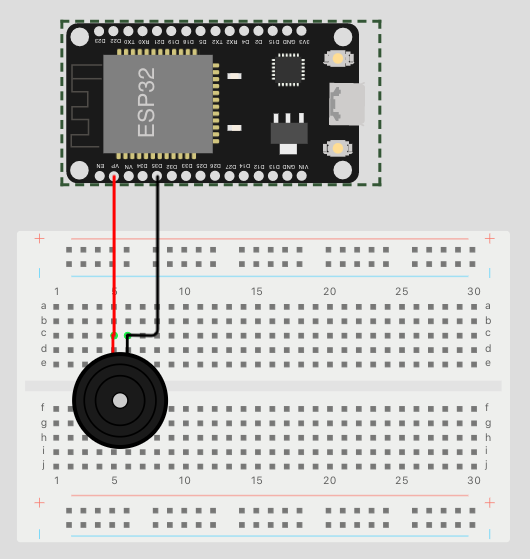

<br/>
<p align="center">
  <a href="https://github.com/aronkahrs-us/ESPHome-Alarm-Panel-Keypad-Rfid-Display">
    
  </a>

  <h1 align="center">ESPHome Alarm Panel</h1>

  <p align="center">
    DIY Alarm Panel using NodeMCU v3 ESP8266 for Home Assistant.
    <br/>
    <br/>
    <a href="https://github.com/aronkahrs-us/ESPHome-Alarm-Panel-Keypad-Rfid-Display"><strong>Explore the docs »</strong></a>
    <br/>
    <br/>
    <a href="https://github.com/aronkahrs-us/ESPHome-Alarm-Panel-Keypad-Rfid-Display/issues">Report Bug</a>
    .
    <a href="https://github.com/aronkahrs-us/ESPHome-Alarm-Panel-Keypad-Rfid-Display/issues">Request Feature</a>
  </p>
</p>

    

## Table Of Contents

* [About the Project](#about-the-project)
* [Parts](#parts)
* [Hardware](#hardware)
  * [Keypad](#keypad)
  * [RFID](#rfid)
  * [Display](#display)
* [Home Assistant](#home-assistant)
* [ESPHome](#esphome)
* [Authors](#authors)
* [Inspiration and Docs](#inspiration-and-docs)

## About The Project
## ⚠️ WORK IN PROGRESS ⚠️


Here I'll try to explain and show how I made this custom alarm panel for Home Assistant with a NodeMCU ESP8266.

## Parts

* NodeMCU v3 ESP8266
* Matrix 4x4 Keypad
* RC522
* Resistors:
  * x1 47Ω
  * x1 100Ω
  * x1 150Ω
  * x1 220Ω
  * x1 270Ω
  * x1 470Ω
  * x2  680Ω
  * x1 910Ω
* Buzzer
* Protoboard( I used a 80x120mm, but you can use any size, or any other platform you like)
* Jumper Wires

## Hardware

We'll start with the Keypad, in this case, I will be using a 4x4 one, you can use a 4x3 but you will need to change some things in [_keypad_custom.h_](https://github.com/aronkahrs-us/ESPHome-Alarm-Panel-Keypad-Rfid-Display/blob/main/ESPHome/keypad_custom.h).
For this part, we are going to create a [custom text sensor](https://esphome.io/components/text_sensor/custom.html), for all the others we'll use ESPHome components.

### Keypad

We could use 8 Digital pins of our NodeMCU to connect the keypad, _and if you only want the keypad functionality it's recommended_, but we still need to connect the RC522 and the Display, so we'll need those pins later, we are going to "free" pins by turning the keypad into a selectable voltage divider circuit, where each button is selecting a different divider configuration, resulting in a different voltage which we'll be measuring to determine which key was pressed.


> Ignore the ESP32 Tag, just connect in the respective pins on the ESP8266(In this case we connect **3.3V, GND and A0**).

#### At this point we can test the keypad, just flash the [_keypad_raw_values_](https://github.com/aronkahrs-us/ESPHome-Alarm-Panel-Keypad-Rfid-Display/blob/main/test/keypad_raw_values.ino) file from the Arduino IDE, and open Serial Monitor.

You will need to store the raw values corresponding to each key, that's the value from the voltage divider circuit keypad and it's what we will use to determine the pressed key.

Once we have that data, we may like to know if it's right and will work, so we'll pass the values we got to [_keypad_test_](https://github.com/aronkahrs-us/ESPHome-Alarm-Panel-Keypad-Rfid-Display/blob/main/test/keypad_test.ino), if you are getting the correct values we are ready for the next step, if not check the connections and retry the last step, also you can play a bit with the _range_ value.

### RFID

For RFID I'm going to use the RC522,_you may use some other part, look at the connections for your specific part_, the RC522 has also 8 pins(we only use 7), **GND, 3.3V** (which don't use any GPIO), **SDA, SCK, MOSI, MISO and RST**, it also has an IRQ but we don't use it, so that is 5 GPIO pins.

We will connect them to **D4, D5, D7, D6 and D3** respectively.
Also connect the 3.3V and GND, connecting them to the board or the "keypad trace" depending on your design.

> Again, ignore the ESP32 Tag, just connect in the respective pins on the ESP8266(In this case we connect **D4, D5, D7, D6 and D3**).

### Display

As a Display I'm using the MAX7219 7-Segment, _you can use any other display see here the [supported ones](https://esphome.io/index.html#display-components)_, this display has 5 pins **VCC, GND, DIN, CS, CLK**

We will connect them to **D0, D1 and D2** respectively.
Also, connect the VCC to VV on the board and GND, connecting them to the board or the "keypad trace" depending on your design.


> Again, ignore the ESP32 Tag, just connect in the respective pins on the ESP8266(In this case we connect **D0, D1, D2**).

### Buzzer

The Buzzer will be useful for the interaction with the panel, it buzzes when the alarm state changes and when you read an RFID tag, you could also make it buzz when you press a key, but I didn't implement it in my case.

The Buzzer has 2 pins **GND and +**, **GND** will go to any **GND** pin on the board or any other **GND** lead we already have and the **+** pin will go to **D8**


> For the last time, ignore the ESP32 Tag, just connect in the respective pins on the ESP8266(In this case we connect **D8**).
## Home Assistant

We'll need to create a template sensor, a helper and 3 automations in Home Assistant

> Template sensor:
```YML
- platform: template
  sensors:
    alarm_state:
      value_template: >-
        
        
        
          {{ alarm_states[state] if state in alarm_states else 9 }}
        
          {{ states('sensor.keypad_live') }}
        
      friendly_name: Alarm State (esphome)
      icon_template: mdi:security
```
> Timer:
```YML
timer:
  keypad_numbers:
    duration: "00:00:15"
```

> Automation Arm from Keypad:
```YML
alias: ALARM - Arm from Keypad
description: "When 'A' is pressed, it sends the written code and if its on Alarmo it will arm the alarm"
trigger:
  - platform: state
    entity_id:
      - binary_sensor.arm
    from: "off"
    to: "on"
condition: []
action:
  - service: alarm_control_panel.alarm_arm_away
    data:
      code: "{{ states('sensor.keypad_live') }}"
    target:
      entity_id: alarm_control_panel.alarmo
mode: single

```

> Automation disarm from Keypad:
```YML
alias: ALARM - Disarm Keypad
description: "When 'D' is pressed, it sends the written code and if its on Alarmo it will disarm the alarm"
trigger:
  - platform: state
    entity_id:
      - binary_sensor.disarm
    from: "off"
    to: "on"
condition: []
action:
  - service: alarm_control_panel.alarm_disarm
    data:
      code: "{{ states('sensor.keypad_live') }}"
    target:
      entity_id: alarm_control_panel.alarmo
mode: single
```

> Automation Text shown in the keypad:
```YML
alias: MISC - Keypad text
description: "This controls what is shown on the keypad display, basically it starts the timer and when it's on the display will show the current code"
trigger:
  - platform: state
    entity_id:
      - sensor.keypad_live
condition: []
action:
  - service: timer.start
    data: {}
    target:
      entity_id: timer.keypad_numbers
  - wait_for_trigger:
      - platform: state
        entity_id:
          - binary_sensor.arm
          - binary_sensor.disarm
    continue_on_timeout: false
    timeout:
      hours: 0
      minutes: 0
      seconds: 10
      milliseconds: 0
  - service: timer.finish
    data: {}
    target:
      entity_id: timer.keypad_numbers
mode: single
```

## ESPHome
Once you have flashed your board and adopted it in Home Assistant, we're going to edit it:
```YML
esphome:
  name: alarmo-keypad
  includes:
    - keypad_custom.h
    - binary_sensor_custom.h

esp8266:
  board: nodemcuv2

# Enable logging
logger:

# Enable Home Assistant API
api:

ota:

wifi:
  ssid: !secret wifi_ssid
  password: !secret wifi_password

  power_save_mode: none
  
  # Enable fallback hotspot (captive portal) in case wifi connection fails
  ap:
    ssid: "Esphome-Web-F2491E"
    password: "TOBQxpayIhQj"

captive_portal:

# Create the custom text sensors for the keypad values
text_sensor:
- platform: custom
  lambda: |-
    auto my_custom_sensor = new MyCustomTextSensor();
    App.register_component(my_custom_sensor);
    return {my_custom_sensor->code,my_custom_sensor->live};

  text_sensors:
    - name: "Keypad"
      icon: "mdi:dialpad"
    - name: "Keypad_live"
      icon: "mdi:dialpad"
      
# Create the custom binary sensors
binary_sensor:
  - platform: custom
    lambda: |-
      auto my_custom_sensor = new MyCustomBinarySensor();
      App.register_component(my_custom_sensor);
      return {my_custom_sensor->arm,my_custom_sensor->disarm};

    binary_sensors:
      - name: "Arm"
      - name: "Disarm"
# Create the custom binary sensors for the RFID tags
  - platform: rc522
    uid: XX-XX-XX-XX
    name: "Alarmo Tag 1"
  - platform: rc522
    uid: XX-XX-XX-XX
    name: "Alarmo Card 1"
    
# Create the buzzer output
output:
  - platform: esp8266_pwm
    pin: GPIO15
    id: rtttl_out

rtttl:
  output: rtttl_out
# Create a number template to control the display brightness
number:
  - platform: template
    name: "Alarm keypad brightness"
    id: keypad_brightness
    optimistic: true
    min_value: 0
    max_value: 15
    step: 1

# Setup the SPI for the RV522 and Display
spi:
  - id: "RC522"
    clk_pin: D5
    miso_pin: D6
    mosi_pin: D7
  - id: "Display"
    clk_pin: D2
    mosi_pin: D0
    
# Create the RC522 Sensor
rc522_spi:
  spi_id: "RC522"
  cs_pin: D4
  update_interval: 1s
  on_tag:
    then:
      - homeassistant.tag_scanned: !lambda 'return x;'
      - rtttl.play: 'two short:d=4,o=5,b=100:16e6,16e6'
      
# Initialize the Display
display:
  - platform: max7219
    spi_id: "Display"
    cs_pin: D1
    num_chips: 1
    id: "Segment"
    intensity: 8
    lambda: |-
        it.print("        ");
        if (id(alarm_state).state == 0) {
          it.print("Disarmed");
        } else if (id(alarm_state).state == 1) {
          it.print("Arming");
        } else if (id(alarm_state).state == 2) {
          it.print("Away");
        } else if (id(alarm_state).state == 3) {
          it.print("Home");
        } else if (id(alarm_state).state == 4) {
          it.print("Night");
        } else if (id(alarm_state).state == 5) {
          it.print("Vacation");
        } else if (id(alarm_state).state == 6) {
          it.print("Custom");
        } else if (id(alarm_state).state == 7) {
          it.print("Pending");
        } else if (id(alarm_state).state == 8) {
          it.print("ALERTA");
        } else if (id(alarm_state).state == 9) {
          it.print("Unavail");
        } else {
          it.printf(2, "%.0f", id(keypad_live).state);
        }
        it.set_intensity(id(keypad_brightness).state);
# "Import" Home assistant entities states
sensor:
  - platform: homeassistant
    name: "live text"
    entity_id: sensor.keypad_live
    id: keypad_live
  - platform: homeassistant
    name: "Alarm state"
    entity_id: sensor.alarm_state
    id: alarm_state
    on_value:
      then:
        - if:
            condition:
              lambda: 'return id(alarm_state).state == 0;'
            then:
              - rtttl.play: 'disarmed:d=4,o=5,b=100:16e5,16d5,16c5'
            else:
              - if:
                  condition:
                    lambda: 'return id(alarm_state).state == 1;'
                  then:
                    - rtttl.play: 'arming:d=4,o=5,b=100:16c5,p,16c5,p,16c5'
                  else:
                    - if:
                        condition:
                          lambda: 'return id(alarm_state).state == 2;'
                        then:
                          - rtttl.play: 'armed:d=4,o=5,b=100:16c5,16d5,16e5'
                        else:
                          - if:
                              condition:
                                lambda: 'return id(alarm_state).state == 8;'
                              then:
                                - while:
                                    condition:
                                      lambda: 'return id(alarm_state).state == 8;'
                                    then:
                                      - rtttl.play: 'siren:d=8,o=5,b=100:e,d'
                                      - delay: 0.5s

```
Once we have edited it we'll install it, **make sure you downloaded and have _binary_sensor_custom.h_ and _keypad_custom.h_ in place before installing**, in my case I'll install it via USB, so I'll select _"Plug into this computer"_, download the file and install it from the [ESPHome Wizard](https://web.esphome.io/), but you can install it however you want.

Once it's installed everything should work, if it does not, check every connection and the code, if it still does not work feel free to contact me for help!

Hope this is useful for someone, keep going smart!
## Authors

* **Aron Kahrs** - [Aron Kahrs](https://github.com/aronkahrs-us)

## Inspiration and Docs

* [Connect A 4×4 Keypad To One Arduino Input](https://www.the-diy-life.com/connect-a-4x4-keypad-to-one-arduino-input/)
* [RFID Reader with NodeMCU (RC522)](https://miliohm.com/rc522-rfid-reader-with-nodemcu/)
* [RC522 RFID](https://esphome.io/components/binary_sensor/rc522.html)
* [MAX7219 7-Segment Display](https://esphome.io/components/display/max7219.html)
* [Rtttl Buzzer](https://esphome.io/components/rtttl.html)
* [Custom Sensor Component](https://esphome.io/components/sensor/custom.html)
* [Custom Text Sensor](https://esphome.io/components/text_sensor/custom.html)
* [Custom Binary Sensor](https://esphome.io/components/binary_sensor/custom.html)
