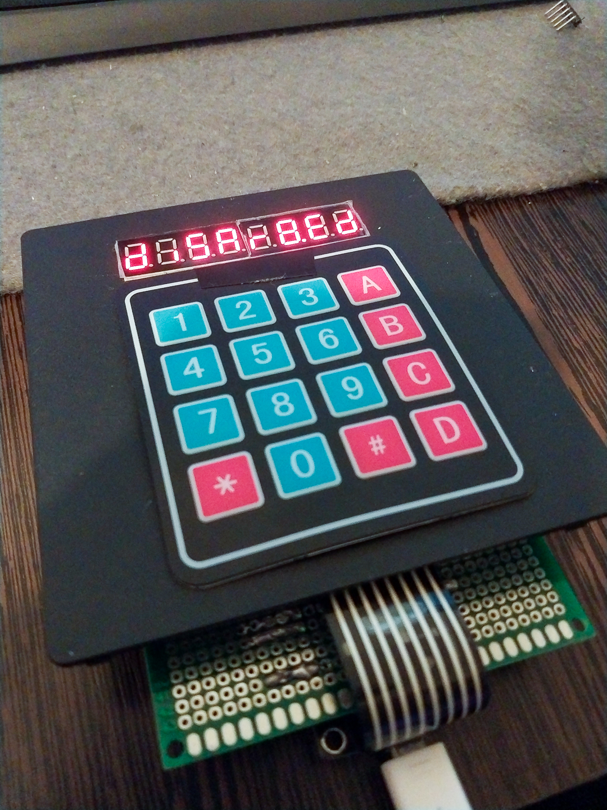
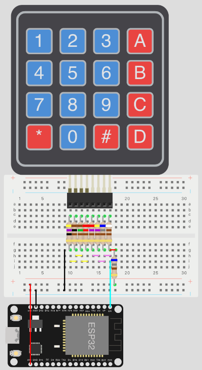
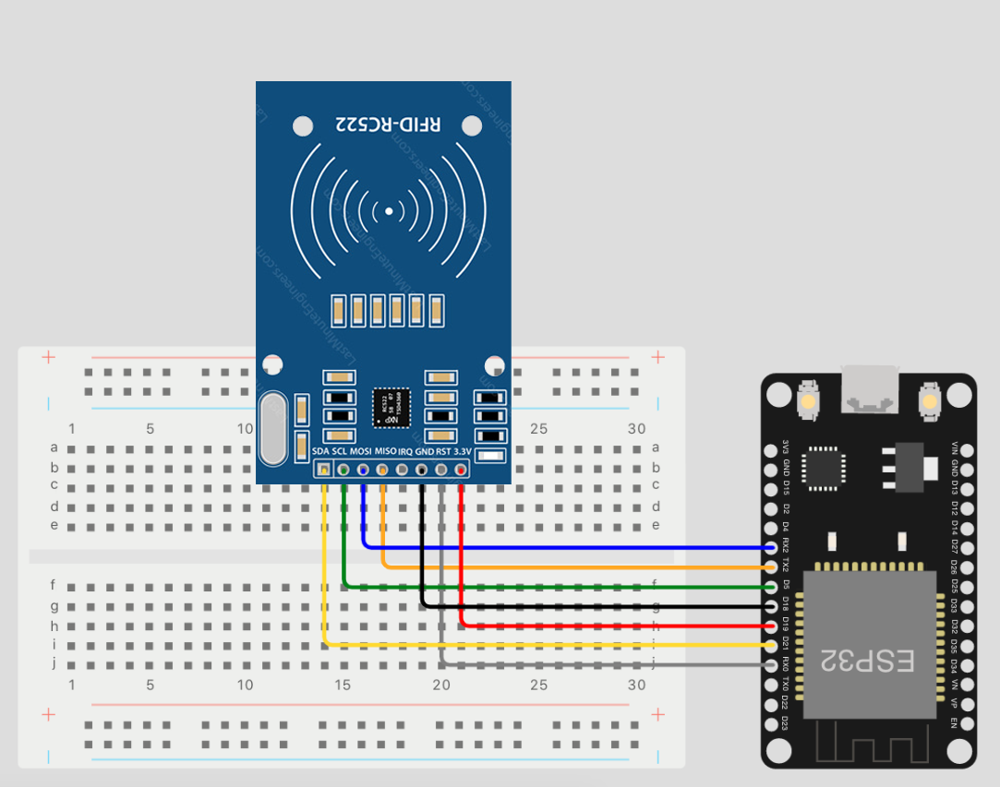
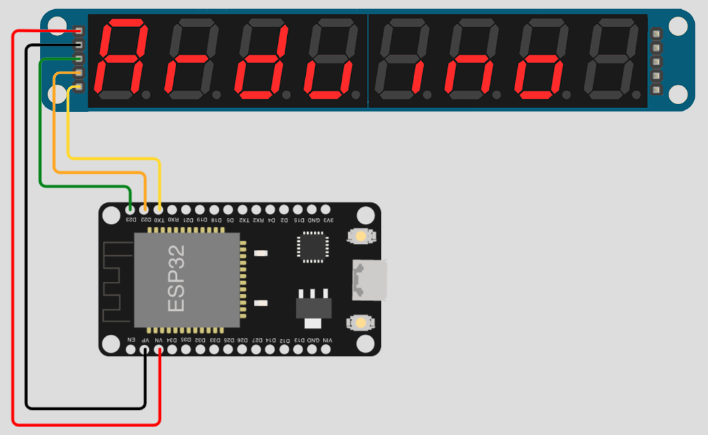

 

  

  <h3 align="center">ESPHome Alarm Panel</h3>

  

    DIY Alarm Panel using NodeMCU v3 ESP8266 for Home Assistant.
     
     
    <a href="https://github.com/aronkahrs-us/ESPHome-Alarm-Panel-Keypad-Rfid-Display"><strong>Explore the docs »</strong></a>
     
     
    <a href="https://github.com/aronkahrs-us/ESPHome-Alarm-Panel-Keypad-Rfid-Display">View Demo</a>
    .
    <a href="https://github.com/aronkahrs-us/ESPHome-Alarm-Panel-Keypad-Rfid-Display/issues">Report Bug</a>
    .
    <a href="https://github.com/aronkahrs-us/ESPHome-Alarm-Panel-Keypad-Rfid-Display/issues">Request Feature</a>
  

    

## Table Of Contents

* [About the Project](#about-the-project)
* [Parts](#parts)
* [Getting Started](#getting-started)
  * [Keypad](#keypad)
  * [RFID](#rfid)
  * [Display](#display)
* [Usage](#usage)
* [Contributing](#contributing)
* [Authors](#authors)
* [Acknowledgements](#acknowledgements)

## About The Project
## ⚠️ WORK IN PROGRESS ⚠️

Here I'll try to explain and show how I made this custom alarm panel for Home Assistant with a NodeMCU ESP8266.

## Parts

* NodeMCU v3 ESP8266
* Matrix 4x4 Keypad
* RC522
* Resistors:
  * x1 47Ω
  * x1 100Ω
  * x1 150Ω
  * x1 220Ω
  * x1 270Ω
  * x1 470Ω
  * x2  680Ω
  * x1 910Ω
* Buzzer
* Protoboard( I used a 80x120mm, but you can use any size, or any other platform you like)
* Jumper Wires

## Getting Started

We'll start with the Keypad, in this case I will be using a 4x4 one, you can use a 4x3 but you will need to change some things in [_keypad_custom.h_](https://github.com/aronkahrs-us/ESPHome-Alarm-Panel-Keypad-Rfid-Display/blob/main/ESPHome/keypad_custom.h).
For this part we are going to create a [custom text sensor](https://esphome.io/components/text_sensor/custom.html), for all the other we'll use ESPHome components.

### Keypad

We could use 8 Digital pins of our NodeMCU to connect the keypad, _and if you only want the keypad functionality it's recommended_, but we still need to connect the RC522 and the Display, so we'll really need those pins later, what we are going to do to "free" pins is basically turning the keypad into a selectable voltage divider circuit, where each button is selecting a different divider configuration, resulting in a different voltage which we'll be measuring to determine which key was pressed.

> Ignore the ESP32 Tag, just connect in the respective pins on the ESP8266(In this case we connect 3.3V, GND and A0).

#### At this point we can test the keypad, just flash the [_keypad_raw_values_](https://github.com/aronkahrs-us/ESPHome-Alarm-Panel-Keypad-Rfid-Display/blob/main/test/keypad_raw_values.ino) file from the Arduino IDE, and open Serial Monitor.

You will need to store the raw values corresponding to each key, that's the value from the voltage divider circuit keypad and it's what we will use to determine the pressed key.

Once we have that data, we may like to know if it's right and will work, so we'll pass the values we got to [_keypad_test_](https://github.com/aronkahrs-us/ESPHome-Alarm-Panel-Keypad-Rfid-Display/blob/main/test/keypad_test.ino), if you are getting the correct values we are ready for the next step, if not check the connections and retry the last step, also you can play a bit with the _range_ value.

### RFID

For RFID I'm going to use the RC522,_you may use some other part, look the connections for your specific part_, the RC522 has also 8 pins(we only use 7), GND, 3.3V (which don't use any GPIO), SDA, SCK, MOSI, MISO and RST, it also has an IRQ but we don't use it, so that is 5 GPIO pins.

We will connect them to D4, D5, D7, D6 and D3 respectively.
Also connect the 3.3V and GND, connecting them to the board or to the "keypad trace" depends on your design.

> Again, ignore the ESP32 Tag, just connect in the respective pins on the ESP8266(In this case we connect D4, D5, D7, D6 and D3).

### Display

As a Display I'm using the MAX7219 7-Segment, _you can use any other display see here the [supported ones](https://esphome.io/index.html#display-components)_, this display has 5 pins VCC, GND, DIN, CS, CLK

We will connect them to D0, D1 and D2 respectively.
Also connect the VCC to VV on the board and GND, connecting them to the board or to the "keypad trace" depends on your design.

> Again, ignore the ESP32 Tag, just connect in the respective pins on the ESP8266(In this case we connect D0, D1, D2).

## Authors

* **Aron Kahrs** - [Aron Kahrs](https://github.com/aronkahrs-us)

## Acknowledgements

* [Connect A 4×4 Keypad To One Arduino Input](https://www.the-diy-life.com/connect-a-4x4-keypad-to-one-arduino-input/)
* [RFID Reader with NodeMCU (RC522)](https://miliohm.com/rc522-rfid-reader-with-nodemcu/)
